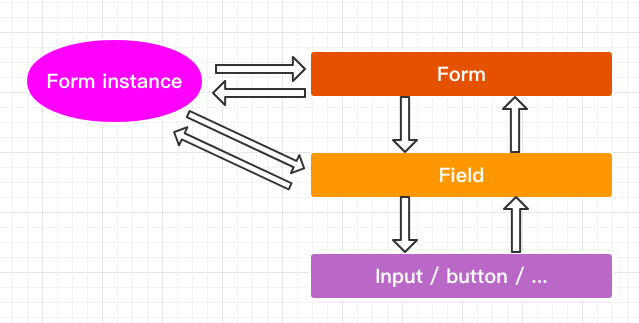

## 使用范式及设计思路

首先我们需要一个表单，它的使用范式如下所示：

```tsx
import { createRef, Component, useEffect } from 'react'
import Form, { Field } from '@form'
import { Input } from '@form/components'

const nameRules = { required: true, message: '请输入姓名！' }
const passwordRules = { required: true, message: '请输入密码！' }

export default function MyRCFieldForm() {
  const [form] = Form.useForm()

  const onFinish = (val: any) => {
    console.log('onFinish', val)
  }

  // 表单校验失败执行
  const onFinishFailed = (val: any) => {
    console.log('onFinishFailed', val)
  }

  useEffect(() => {
    console.log('form', form)
    form.setFieldValue({ username: 'default' })
  }, [])

  return (
    <div>
      {/* 函数组件 */}
      <h3>MyRCFieldForm</h3>
      <Form form={form} onFinish={onFinish} onFinishFailed={onFinishFailed}>
        <Field name="username" rules={[nameRules]}>
          <Input placeholder="input UR Username" />
        </Field>
        <Field name="password" rules={[passwordRules]}>
          <Input placeholder="input UR Password" />
        </Field>
        <button>Submit</button>
      </Form>

      {/* 类组件 */}
      <MyClassFieldForm />
    </div>
  )
}

class MyClassFieldForm extends Component {
  formRef = createRef()

  onFinish = (val: any) => {
    console.log('onFinish', val)
  }

  // 表单校验失败执行
  onFinishFailed = (val: any) => {
    console.log('onFinishFailed', val)
  }

  render() {
    return (
      <div>
        <h3>MyClassFieldForm</h3>
        <Form
          ref={this.formRef}
          onFinish={this.onFinish}
          onFinishFailed={this.onFinishFailed}
        >
          <Field name="username" rules={[nameRules]}>
            <Input placeholder="input UR Username" />
          </Field>
          <Field name="password" rules={[passwordRules]}>
            <Input placeholder="input UR Password" />
          </Field>
          <button>Submit</button>
        </Form>
      </div>
    )
  }
}

```

通过使用范式我们可以得到以下结论：

1. 在组件层面，我们需要 `<Form>`、`<Field>`，它们最终渲染的是  `<Field>` 包裹的表单元素
2. 对于函数组件，我们需要使用 `useForm()` 来生成 Form 实例，并将其通过参数传给 `<Form>`
3. 对于类组件，我们需要创建一个 ref 来获取 Form 实例
4. 示例中的 `button` 没有绑定事件也能正常提交


根据以上结论，我们可以推导出以下设计思路：

* 根据结论1，无论是 `<Form>` 还是 `<Field>`，它们都会装饰并返回 `children`。
* 根据结论2、3：
  * 类组件和函数组件对于 Form 的控制方式不同：
    * 函数组件先通过 `useForm()` 生成 Form 实例，并通过参数传给 `<Form>`，这样函数组件就能通过该 Form 实例对 Form 进行控制。
    * 类组件是先生成一个 ref，通过参数传给 `<Form>`，这样类组件就能通过 ref 对 Form 进行控制。
  * 对于 `<Form>`，无论使用它的是类组件还是函数组件都需要有一个 Form 实例，对于函数组件来说 Form 实例是函数组件自己生成并当作参数传给 `<Form>`。
    而对于类组件来说并没有自己生成 Form 实例，因此在 `<Form>` 内部要对这两种情况作兼容。
    兼容方式很明显，如果使用者有通过参数传 Form 实例就用外界传来的，如果没有则自己生成并将该 Form 实例返回给外界传入的 ref。
  * 整个 Form 是通过 Form 实例进行控制，比如说规则校验、提交等等。
* 根据结论4，`<Form>` 的子组件肯定包括 `<form>`。



图1：Form 整体架构


## 1. 最简实现

首先把整体架构搭好，后面再补充细节，为了实现最简版本，一开始只考虑调用组件为函数组件。

从图一可以看出，`Form Instance` 需要和 `<Form>` 交互，也要和 `<Field>` 交互，需要注意的是 `<Form>` 和 `<Field>` 不一定是父子组件，中间可能隔着 `<div>` 这样的组件。因此通过参数传递有点不合适，使用 context 能保证它们都能拿到同一 `Form Instance`。

* Form.tsx
* Field.tsx
* useForm.ts
* FieldContext.ts
* form.d.ts

**form.d.ts**

```ts
import { FormStore } from './useForm'
  
export type FormProps = {
  form?: ReturnType<FormStore['getForm']>
  children: JSX.Element | JSX.Element[]
} & FormCallbacks

export type FieldProps = {
  name: string
  children: ReactElement<any, string | JSXElementConstructor<any>>
  rules?: Array<{ required: boolean, message: string }>
}

export type FieldContextType = ReturnType<FormStore['getForm']>
```

**FieldContext.ts**

```ts
import type { FieldContextType } from './form.d'
import { createContext } from 'react'
import { FormStore } from './useForm'

// 这里的参数只是为了不让 ts 报错，真正的 Form 实例还是要在 <Form> 中获得
export const FieldContext = createContext<FieldContextType>(new FormStore().getForm())
```

**useForm.ts**

```ts
import { useRef } from 'react'

export default function useForm() {
  const store = useRef(new FormStore()).current
  return [store]
}

// Form 实例仓库，要实现两个功能点
// 1.存储状态
// 2.更新状态 -> 更新仓库值 + 通知组件更新
export class FormStore {
  // store 存的是一个个键值对，键名是 <Field> 的 name，键值是 <Field> 包裹表单的值
  private store: Record<string, any> = {}
  
  // 取
  getFieldsValue = () => {
    return { ...this.store }
  }
  
  getFieldValue = (name: string) => {
    return this.store[name]
  }
  
  // 存
  setFieldValue = (val: Record<string, any>) => {
    // 1.更新仓库值
    this.store = { ...this.store, ...val }
    // todo 2.通知组件更新
  }
  
  // 统一接口
  getForm = () => {
    return {
      getFieldsValue: this.getFieldsValue,
      getFieldValue: this.getFieldValue,
      setFieldValue: this.setFieldValue,
    }
  }
}
```

**Form.tsx**

```tsx
import Field from './Field'
import useForm from './useForm'
import { FieldContext } from './FieldContext'

export default function Form(props: FormProps) {
  const { children, form } = props

  return (
    <form>
    	<FieldContext.Provider value={form}>
      	{children}
      </FieldContext.Provider>
    </form>
  )
}

Form.Field = Field
Form.useForm = useForm
```

**Field.tsx**

```tsx
import type { FieldProps } from './form.d'
import { cloneElement, useCallback, useContext } from 'react'
import { FieldContext } from './FieldContext'

export default function Field(props: FieldProps) {
  const { children, name } = props
  const { getFieldValue, setFieldValue } = useContext()
  
  const controller = useCallback(() => {
    return {
      value: getFieldValue(name),
      onChange(e: Event) {
        const target = e.target ass HTMLInputElement | HTMLButtonElement
        const newValue = target.value
        setFieldValue({ [name]: newValue })
      },
    }
  }, [])
  
  return cloneElement(children, controller())
}
```

至此，Demo 应该能把页面渲染出来了，但是输入时表单还没能变化。

这时在 FormStore 的 `setFieldValue` 中打印 `this.store` 可以发现在仓库中状态值确实已经改变了，但是对于 React 组件来说感知不到，因此要在 `<Field>` 中创建某种更新手段，让 FormStore 在 `setFieldValue()` 之后调用。

**思考题1：在 Field.tsx 中，controller 能否用 useMemo() 代替实现，如下面代码所示**

```tsx
const controller = useMemo(() => {
  return {
    value: getFieldValue(name),
    onChange(e: Event) {
      const target = e.target ass HTMLInputElement | HTMLButtonElement
      const newValue = target.value
      setFieldValue({ [name]: newValue })
    },
  }
}, [name, getFieldValue, setFieldValue])
```


## 2. 实现组件更新

首先想明白组件更新的时机，观察上面架构，我们需要在 FormStore 进行仓库值更新之后通知组件更新，为了达到该目的我们需要在 FormStore 内部拿到 `<Field>` 实例，或者 `<Field>` 给 FormStore 所需的东西。

对于类组件实现的 `<Field>` 来说，把组件实例 `this` 直接给 FormStore，FormStore 就能调用上面的更新组件方法，比如说 `this.forceUpdate`。

对于函数组件实现的 `<Field>` 来说，可以把一个对象给 FormStore，这个对象包含更新 `<Field>` 方法。

这样在更新仓库值之后，就可以调用 `<Field>` 传来的更新函数对 `<Field>` 进行更新了。

* useForm.ts
* Field.tsx
* form.d.ts

**useForm.ts**

```ts
// ++++++++++++++++++++++++++++++++
import type { Entity } from './form.d'
// ++++++++++++++++++++++++++++++++
import { useRef } from 'react'

export default function useForm() {
  const store = useRef(new FormStore()).current
  return [store]
}

// Form 实例仓库，要实现两个功能点
// 1.存储状态
// 2.更新状态 -> 更新仓库值 + 通知组件更新
export class FormStore {
  // store 存的是一个个键值对，键名是 <Field> 的 name，键值是 <Field> 包裹表单的值
  private store: Record<string, any> = {}
  // ++++++++++++++++++++++++++++++++
  private fieldEntities: Set<Entity> = new Set()
  
  // 注册 <Field> 组件实例
  registerEntities = (entity: Entity) => {
    this.fieldEntities.add(entity)
    // 组件卸载时注销相关实例
    return () => {
      this.fieldEntities.delete(entity)
      delete this.store[entity.props.name]
    }
  }
  // ++++++++++++++++++++++++++++++++
  
  // 取
  getFieldsValue = () => {
    return { ...this.store }
  }
  
  getFieldValue = (name: string) => {
    return this.store[name]
  }
  
  // 存
  setFieldValue = (val: Record<string, any>) => {
    // 1.更新仓库值
    this.store = { ...this.store, ...val }
    // ++++++++++++++++++++++++++++++++
    // 2.通知组件更新
    const updateKeys = Object.keys(val)
    this.fieldEntities.forEach(entity => {
      if (updateKeys.includes(entity.props.name)) {
        // 规定 <Field> 更新自己的方法名就叫 onStoreChanged
        entity.onStoreChanged()
      }
    })
    // ++++++++++++++++++++++++++++++++
  }
  
  // 统一接口
  getForm = () => {
    return {
      // ++++++++++++++++++++++++++++++++
      registerEntities: this.registerEntities,
      // ++++++++++++++++++++++++++++++++
      getFieldsValue: this.getFieldsValue,
      getFieldValue: this.getFieldValue,
      setFieldValue: this.setFieldValue,
    }
  }
}
```

**Field.tsx**

```tsx
import type { FieldProps } from './form.d'
// ++++++++++++++++++++++++++++++++
import { cloneElement, useCallback, useContext, useEffect, useReducer } from 'react'
// ++++++++++++++++++++++++++++++++
import { FieldContext } from './FieldContext'

export default function Field(props: FieldProps) {
  const { children, name } = props
  // ++++++++++++++++++++++++++++++++
  const { getFieldValue, setFieldValue, registerEntities } = useContext()
  
  const [, forceUpdate] = useReducer(x => x + 1, 0)
  
  
  // 组件挂载时注册组件实例，卸载时注销
  useEffect(() => {
    const unregister = registerEntities({ props, onStoreChanged: forceUpdate })
    
    return () => {
      unregister()
    }
  }, [props])
  // ++++++++++++++++++++++++++++++++
  
  const controller = useCallback(() => {
    return {
      value: getFieldValue(name),
      onChange(e: Event) {
        const target = e.target ass HTMLInputElement | HTMLButtonElement
        const newValue = target.value
        setFieldValue({ [name]: newValue })
      },
    }
  }, [])
  
  return cloneElement(children, controller())
}
```

**form.d.ts**

```ts
import type { ReactElement } from 'react'
import { FormStore } from './useForm'

export type FormProps = {
  form?: ReturnType<FormStore['getForm']>
  children: JSX.Element | JSX.Element[]
} & FormCallbacks

export type FieldProps = {
  name: string
  children: ReactElement<any, string | JSXElementConstructor<any>>
  rules?: Array<{ required: boolean, message: string }>
}

export type FieldContextType = ReturnType<FormStore['getForm']>

// ++++++++++++++++++++++++++++++++
export type Entity = ReactElement & { onStoreChanged(): void }
// ++++++++++++++++++++++++++++++++
```

至此，Demo 中的输入框输入内容时就能看到新输入的内容了。

注意在函数组件实现主动更新使用了一个比较巧妙的方法：

```ts
const [, forceUpdate] = useReducer(x => x + 1, 0)
```

回顾一下 React 组件更新条件：

* 主动更新
  * 类组件
    * this.setState()
    * this.forceUpdate()
  * 函数组件
    * const [val, setVal] = useState(0)
    * const [val, setVal] = useReducer(reducer, initialVal)
* 被动更新
  * props 发生更新
  * 接收的 context 发生更新

`useReducer` 和 `useState` 都是给 Fiber 挂上对应的状态，因此调用更新函数就可以主动更新自己的状态，由于我们并不关心这个值具体是什么，因此只要取更新函数即可。


## 3. 实现提交

回顾一下 Demo，我们是在 `<Form>` 组件中传入的 `onFinish` 和 `onFinishFailed`，`field context` 和 `<form>` 都是在 `<Form>` 当中，很明显提交方法要在 `<Form>` 实现。

当然在提交前我们要实现校验，这样我们才能知道是调用  `onFinish` 还是 `onFinishFailed`。

* Form.tsx
* useForm.ts
* form.d.ts

**Form.tsx**

```tsx
import Field from './Field'
import useForm from './useForm'
import { FieldContext } from './FieldContext'
// ++++++++++++++++++++++++++++++++
import { useCallback, useEffect } from 'react'
// ++++++++++++++++++++++++++++++++

export default function Form(props: FormProps) {
  // ++++++++++++++++++++++++++++++++
  const { children, form, onFinish, onFinishFailed } = props
  
  // 组件挂载时注册 onFinish 和 onFinishFailed
  useEffect(() => {
    form.setCallbacks({ onFinish, onFinishFailed })
  }, [form, onFinish, onFinishFailed])
  
  const handleSubmit = useCallback((e: FormEvent<HTMLFormElement>) => {
    e.preventDefault()
    form.submit()
  }, [form])
  // ++++++++++++++++++++++++++++++++

  return (
    <form onSubmit={handleSubmit}>
    	<FieldContext.Provider value={form}>
      	{children}
      </FieldContext.Provider>
    </form>
  )
}

Form.Field = Field
Form.useForm = useForm
```

**useForm.ts**

```ts
// ++++++++++++++++++++++++++++++++
import type { Entity, FormCallbacks } from './form.d'
// ++++++++++++++++++++++++++++++++
import { useRef } from 'react'

export default function useForm() {
  const store = useRef(new FormStore()).current
  return [store]
}

// Form 实例仓库，要实现两个功能点
// 1.存储状态
// 2.更新状态 -> 更新仓库值 + 通知组件更新
export class FormStore {
  // store 存的是一个个键值对，键名是 <Field> 的 name，键值是 <Field> 包裹表单的值
  private store: Record<string, any> = {}
  private fieldEntities: Set<Entity> = new Set()
  // ++++++++++++++++++++++++++++++++
  private callbacks: FormCallbacks = {} as any
  
  private valiedate = () => {
    const err: Array<{ [K in string]: { message: string } }> = []
    
    this.fieldEntities.forEach(entity => {
      const { rules, name } = entity.props
      const rule = rules[0]
      
      if (rule?.isRequired && isFalsy(this.getFieldValue(name))) {
        err.push({ [name]: rule.message })
      }
    })

    return err
  }
  
  submit = () => {
    const { onFinish, onFinishFailed } = callbacks
    const err = this.validate()

    return err.length ? onFinishFailed(err, this.getFieldsValue()) : onFinish(this.getFieldsValue())
  }

  setCallbacks = (callbacks: Partial<FormCallbacks>) => {
    this.callbacks = { ...this.callbacks, ...callbacks }
  }
  // ++++++++++++++++++++++++++++++++
  
  // 注册 <Field> 组件实例
  registerEntities = (entity: Entity) => {
    this.fieldEntities.add(entity)
    // 组件卸载时注销相关实例
    return () => {
      this.fieldEntities.delete(entity)
      delete this.store[entity.props.name]
    }
  }
  
  // 取
  getFieldsValue = () => {
    return { ...this.store }
  }
  
  getFieldValue = (name: string) => {
    return this.store[name]
  }
  
  // 存
  setFieldValue = (val: Record<string, any>) => {
    // 1.更新仓库值
    this.store = { ...this.store, ...val }
    // 2.通知组件更新
    const updateKeys = Object.keys(val)
    this.fieldEntities.forEach(entity => {
      if (updateKeys.includes(entity.props.name)) {
        // 规定 <Field> 更新自己的方法名就叫 onStoreChanged
        entity.onStoreChanged()
      }
    })
  }
  
  // 统一接口
  getForm = () => {
    return {
      // ++++++++++++++++++++++++++++++++
      submit: this.submit,
      setCallbacks: this.setCallbacks,
      // ++++++++++++++++++++++++++++++++
      registerEntities: this.registerEntities,
      getFieldsValue: this.getFieldsValue,
      getFieldValue: this.getFieldValue,
      setFieldValue: this.setFieldValue,
    }
  }
}

// ++++++++++++++++++++++++++++++++
function isFalsy(val: unknown) {
  return val === undefined || val === null || val === '' || val === false
}
// ++++++++++++++++++++++++++++++++
```

**form.d.ts**

```ts
import type { ReactElement } from 'react'
import { FormStore } from './useForm'

export type FormProps = {
  form?: ReturnType<FormStore['getForm']>
  children: JSX.Element | JSX.Element[]
} & FormCallbacks

export type FieldProps = {
  name: string
  children: ReactElement<any, string | JSXElementConstructor<any>>
  rules?: Array<{ required: boolean, message: string }>
}

export type FieldContextType = ReturnType<FormStore['getForm']>

export type Entity = ReactElement & { onStoreChanged(): void }

// ++++++++++++++++++++++++++++++++
export type FormCallbacks = {
  onFinish(val: Record<string, any>): void
  onFinishFailed(err: any[], val: Record<string, any>): void
}
// ++++++++++++++++++++++++++++++++
```

至此，Demo 在点击提交按钮时，如果两个输入框都有内容，则会触发 `onFinish()`；只要有一个输入框无输入，点击提交后就会触发 `onFinishFailed()`。


## 4. 兼容类组件

在上面实现中，调用 `<Form>` 的必须是函数组件，因为必须通过 `useForm()` 获取 Form 实例并传参，而钩子函数只能在函数组件中使用，因此目前类组件还不能使用 `<Form>`。

为了解决这个问题，我们必须要把应用到整个表单的 Form 的设置放在 `<Form>` 中，如果参数有传入 Form 实例则用该示例，否则就自己创建一个并将这个 Form 实例返回出去。

* Form.tsx
* useForm.ts

**Form.tsx**

```tsx
import Field from './Field'
import useForm from './useForm'
import { FieldContext } from './FieldContext'
// ++++++++++++++++++++++++++++++++
import { forwardRef, useCallback, useEffect, useImperativeHandle } from 'react'

type FormType = typeof Form & { Field: typeof Field; useForm: typeof useForm }
// ++++++++++++++++++++++++++++++++

function Form(props: FormProps, ref: ForwardedRef<any>) {
  const { children, form, onFinish, onFinishFailed } = props
  
  // ++++++++++++++++++++++++++++++++
  const FormInstance = useForm(form)
  
  // 类组件传入 ref，<Form ref={formRef}>xxx</Form>
  // 调用这个钩子可以将 formRef.current 设置成 FormInstance
  // 这样类组件就能通过传入 ref 来控制 Form 实例
  useImperativeHandle(ref, () => FormInstance)
  // ++++++++++++++++++++++++++++++++

  useEffect(() => {
    FormInstance.setCallbacks({ onFinish, onFinishFailed })
  }, [FormInstance, onFinish, onFinishFailed])
  
  const handleSubmit = useCallback((e: FormEvent<HTMLFormElement>) => {
    e.preventDefault()
    FormInstance.submit()
  }, [FormInstance])

  return (
    <form onSubmit={handleSubmit}>
    	<FieldContext.Provider value={FormInstance}>
      	{children}
      </FieldContext.Provider>
    </form>
  )
}

export const _Form = forwardRef(Form) as any as FormType
_Form.Field = Field
_Form.useForm = useForm

export default _Form
```

**useForm.ts**

```tsx
// ++++++++++++++++++++++++++++++++
import type { Entity, FormCallbacks, FormProps } from './form.d'
// ++++++++++++++++++++++++++++++++
import { useRef } from 'react'

// ++++++++++++++++++++++++++++++++
// 有传入 form 代表调用 <Form> 的是函数组件，否则就是类组件
export default function useForm(form?: FormProps['form']) {
  const store = useRef(form ? form : new FormStore()).current
  return [store]
}
// ++++++++++++++++++++++++++++++++

export class FormStore {...}

function isFalsy(val: unknown) {
  return val === undefined || val === null || val === '' || val === false
}
```

至此，一个简易 Form 表单的封装就已经完成了。

值得注意的是，使用 `forwardRef` 要和 `useImperativeHandle` 搭配使用，如果不是很熟悉该 API ，可以先到官方文档了解一下。

**思考题2：在 Form.tsx 中，能否用下面代码代替最后的导出**

```ts
function Form(props) {
  xxx
}

Form.Field = Field
Form.useForm = useForm

export const _Form = forwardRef(Form) as any as FormType
export default _Form
```


## 总结与反思

其实这个 Form 在类型设置方面并不完美，很多地方使用了 any，像要照顾类组件的地方如果不用 any 会非常麻烦，像：

```ts
export type FunctionFieldProps = {
  children: ReactElement<any, string | JSXElementConstructor<any>>
  name: string
  rules?: RuleType[]
}

export const _Form = forwardRef(Form) as any as FormType
```

如果只要考虑函数组件，一切都会简单得多，毕竟函数组件本质就是函数。这也是提倡使用函数组件的一个点吧，无论是做业务还是轮子的封装。

当然另一方面还要考虑到为了成为技术大神，掌握 TS 是必须的，在写这个 Form 之前我也学过很多类型体操的套路，刷了一百多道类型体操习题，但是从实践看来要是做封装轮子的工作还差得很远，后面还需要进一步掌握 TS 源码才行。与君共勉~


## 思考题参考答案

**思考题1：在 Field.tsx 中，controller 能否用 useMemo() 代替实现**

```tsx
不能。仔细观察 controller 里面的内容，在 FormStore 里面发生状态变更后，controller 引用的外界变量 (name, getFieldValue, setFieldValue) 并没有发生变化。
因此使用 useMemo() 并不会使 controller 里面的 value 发生变化，从而导致页面上看到的 value 永远没变。

const controller = useCallback(() => {
  return {
    value: getFieldValue(name),
    onChange(e: Event) {
      const target = e.target ass HTMLInputElement | HTMLButtonElement
      const newValue = target.value
      setFieldValue({ [name]: newValue })
    },
  }
}, [])

因此我们要将其做成一个函数，在每次 render 的时候都能拿到最新值:
return cloneElement(children, controller())
```


**思考题2：在 Form.tsx 中，能否用下面代码代替最后的导出**

```
不能。forwardRef() 会对传入组件进行一层包装并返回包装过的组件。

因此，就像是给 <Form> 套了一层 <div>，在外界访问的是包装过的组件而不是被包装的组件。因此给被包装的组件挂载方法，在外界是访问不到的。

这里重点是对 forwardRef() 的把握。
```


