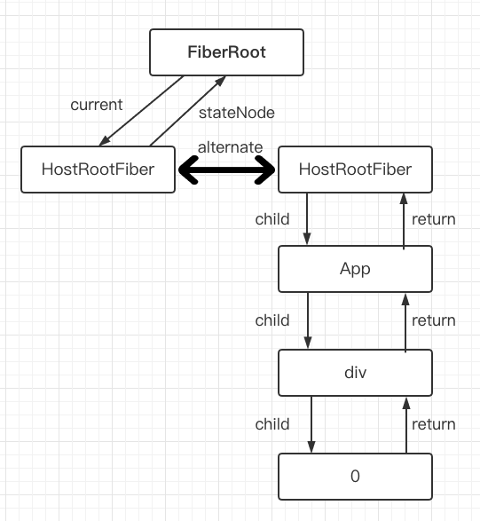
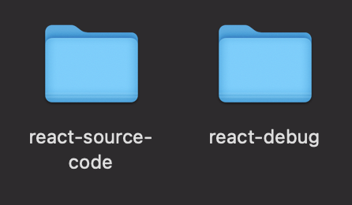
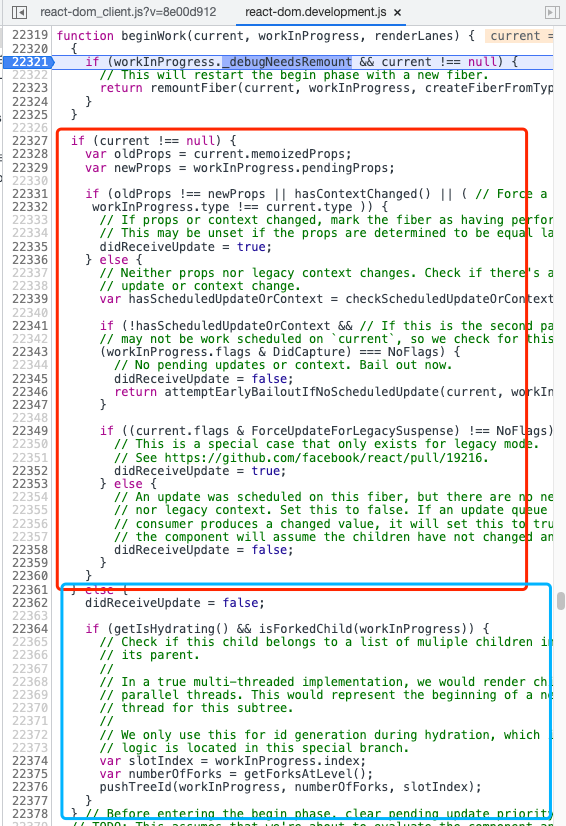
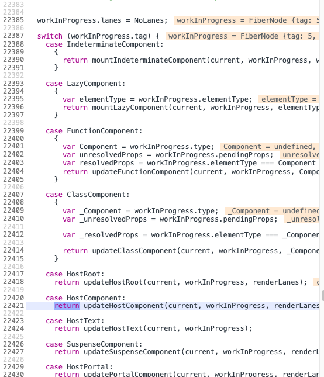
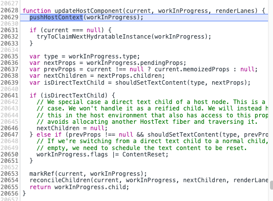
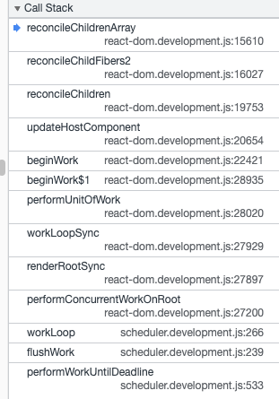

# Hello World

## 设计理念

React 是用 JS 构建 **快速响应** 的大型 web 应用程序的方式。

**制约快速响应的因素**

* IO ( 网络 )
* CPU ( 计算 )

浏览器每 16.6 ms 刷新一次 ( 1000ms / 60Hz )，每一帧要执行 **JS脚本**、**样式布局** 和 **样式绘制**。

如果 JS脚本执行时间过长，浏览器就没时间进行样式布局和样式绘制，呈现出来的效果就是掉帧。

**解决掉帧 -> 解决 JS脚本 执行时间过长问题**

* **异步更新** ( 可中断 )
* 节流、防抖 ( 治标不治本 )

React 解决 JS脚本执行过长的方式就是使用异步更新，React 会使用预留时间来执行 JS，当超过这个预留时间控制权会交还给浏览器，让它执行样式布局和绘制。

## 架构

自 React16 以来，React 的宏观架构分为以下几个部分：

**Scheduler ( 调度器 )** -> **Reconciler ( 协调器 )** -> **Renderer ( 渲染器 )**

不同优先级的任务会首先经过 Scheduler，Scheduler 会将优先级最高的任务送入 Reconciler，在 Reconciler 运行过程中，如果此时有一个更高优先级的任务，此时 Reconciler 的任务会暂停并压入任务栈中，并将更高优先级的任务送入 Reconciler，当完成该更高优先级的任务，再弹栈恢复上一次的任务。

需要注意的是，任务在 Renderer 中是不可中断的。

## 初识 Fiber

**Fiber** 在 React 中有三层含义

* Fiber 架构
* 一种数据结构
* 一种动态工作单元

**Fiber 架构**

在 React 的架构部分，Reconciler 负责的是组件树的 diff，而 fiber 则是 Reconciler 的组成单元，因此 React 的 Reconcile 也叫做 Fiber Reconcile。

**一种数据结构**

假设我们有如下组件

```react
function App() {
  const [count, setCount] = useState(0)

  return <div>{count}</div>
}

ReactDOM.createRoot(document.getElementById('root')!).render(<App />)
```

那首屏渲染时在内存中我们将得到如下内容：



父组件的 child 指向的是第一个子节点，如果该子节点有兄弟节点，则该子节点会用 sibling 指向兄弟节点。

兄弟节点的 return 则指向父节点。

在 diff 时，如果存在节点复用，则会为节点创建一个新节点，二者用 alternate 互相引用。

当 work in progress 树更新完成时，`FiberRoot` 会将 current 指向 work in progress 并提交给 renderer 进行渲染。

**一种动态工作单元**

以下是 Fiber 的初始属性。

```ts
// Instance
this.tag = tag;
this.key = key;
this.elementType = null;
this.type = null;
this.stateNode = null;

// Fiber
this.return = null;
this.child = null;
this.sibling = null;
this.index = 0;

this.ref = null;

this.pendingProps = pendingProps;
this.memoizedProps = null;
this.updateQueue = null;
this.memoizedState = null;
this.dependencies = null;

this.mode = mode;

// Effects
this.flags = NoFlags;
this.subtreeFlags = NoFlags;
this.deletions = null;

this.lanes = NoLanes;
this.childLanes = NoLanes;

this.alternate = null;
```

React 中每个组件都是一个 Fiber，当然也包括原生节点 ( 需要注意的是 jsx 中写的 div 等原生节点并不完全等同于在 html 中写的 div 等原生节点，React 对它们进行了一层包装 )。

在项目运行时，有的属性会随着项目更新而跟着变化，比如 child、各种副作用、状态等等。

## debug react

为了深入理解 react，调试源码是必须的。

为了调试源码，我们需要源码项目和自创的一个项目，目录结构如下：



**源码项目 react-source-code**

1. 拉取源码
   ```shell
   git clone https://github.com/facebook/react.git
   ```

2. 安装依赖
   ```shell
   yarn
   ```

3. 打包
   ```shell
   yarn build react/index,react/jsx,react-dom/index,scheduler --type=NODE
   ```

至此，react 打包产物会放在 build 目录下，其目录结构如下

```
build
	- facebook-www
	- react-native
	- bundle-sizes.json
	- node_modules
    - jest-react
    - react
    - react-dom
    - scheduler
```

其中 `react` 和 `react-dom` 就是待会我们需要 link 的包。

接下来创建 **react-debug**

1. 创建项目
   ```shell
   pnpm create vite react-debug
   ```

2. 进入项目并安装依赖

   ```shell
   cd react-debug
   pnpm i
   ```

3. link react 的打包产物
   ```shell
   pnpm link ../react-source-code/build/node_modules/react
   pnpm link ../react-source-code/build/node_modules/react-dom
   ```

4. 启动项目
   ```shell
   pnpm run dev
   ```

   

为了验证有没有 link 成功，我们在 `react-dom/cjs/react-dom.development.js` 中添加一个打印语句 `console.log('abc')`

如果启动的项目的控制台有打印 abc，说明 link 成功了。

以后要调试新的 react 代码，只需要拉取最新代码并重新打包即可。

# debug

## render

**overview**


从总览图可以将 react 的运行分为两大部分，`render` 和 `commit`。

render 用于决定渲染什么；commit 用于将决定渲染的内容真实地渲染到浏览器上。

**重要的调用节点可作如下简单总结**

```
创建项目根节点
	1.createRoot()
	2.ReactDOMRoot.render()
	3.updateContainer()
	
render
	1.scheduleUpdateOnFiber()
	2.ensureRootIsScheduled()
	3.performWorkUntilDeadline()
	4.flushWork()
	5.workLoop()
	6.performConcurrentWorkOnRoot()
	7.renderRootSync()
	8.workLoopSync()
	9.performUnitOfWork()

	10.beginWork()
	11.updateHostComponent()
	12.reconcileChildren()
	13.reconcileChildFibers2()
	14.reconcileChildrenArray()
	15.createChild()
	16.createFiberFromElement()
	17.createFiberFromTypeAndProps()
	18.createFiber

	19.completeUnitOfWork()
	20.completeWork()

commit
	1.commitRoot()
	2.commitRootImpl()
```

注意，这里列出来的调用顺序并不是每个项目都会严格按照这个顺序来，像 beginWork 和 completeWork 会根据渲染节点的多少来决定执行多少次。

同时这里也没有列出所有的调用方法，这里只是将研究源码时经常会用到的方法列出来，此时记不住也没关系，只要混个脸熟就行，后面讲到相关内容时会详解。


接下来我们会用如下组件进行演示:

```tsx
import { useState } from 'react'
import './App.css'

function App() {
  const [count, setCount] = useState(0)

  return (
    <div className="App">
      <h1>Vite + React</h1>
      <div className="card">
        <button onClick={() => setCount(count => count + 1)}>
          count is {count}
        </button>
        <p>
          Edit <code>src/App.tsx</code> and save to test HMR
        </p>
      </div>
      <p className="read-the-docs">
        Click on the Vite and React logos to learn more
      </p>
    </div>
  )
}

export default App
```

### mount beginWork

启动项目，在控制台的 `source` 中打开 `react-dom`，搜索 `beginWork` 和 `completeWork` 方法并打上断点。

首先确认 Fiber 的构建流程。

```
HostRoot beginWork
	App beginWork
		div beginWork
      h1 beginWork
      h1 completeWork

      div beginWork
        button beginWork
          TextNode(count is) beginWork
          TextNode(count is) completeWork

          TextNode(0) beginWork
          TextNode(0) completeWork
        button completeWork

        p beginWork
          TextNode(Edit ) beginWork
          TextNode(Edit ) completeWork

          code beginWork
          code completeWork

          TextNode( and save to test HMR) beginWork
          TextNode( and save to test HMR) completeWork
        p completeWork
      div completeWork

      p beginWork
      p completeWork
    div completeWork
  App completeWork
HostRoot completeWork
   
```

需要注意的是如果一个节点的子节点只有唯一一个文本子节点，则该文本节点不会单独生成一个 Fiber，如：

```tsx
<code>src/App.tsx</code>
```

如果子节点中有插值变量，那还是会生成对应的 Fiber，如

```tsx
<button onClick={() => setCount(count => count + 1)}>
  count is {count}
</button>
```


接下来，我们从 `div#App` 来深究一下 `beginWork` 究竟做了什么。



通过上文介绍的双缓存架构，我们可以得知在首屏渲染时，当前构建 Fiber 的 `current` 肯定为 null，因此红色部分是给更新用的，而蓝色部分是关于服务端渲染的，这里先略过。



由于此处的视角为 `div#App`，它的 tag 为 `HostComponent`，因此进入 `updateHostComponent` 的逻辑。

对于一个 Fiber，我们通过 tag 进行作用区分，完整的 tag 可以搜索 `ReactWorkTags.js` 进行查阅。

```js
export const FunctionComponent = 0;
export const ClassComponent = 1;
export const IndeterminateComponent = 2; // Before we know whether it is function or class
export const HostRoot = 3; // Root of a host tree. Could be nested inside another node.
export const HostPortal = 4; // A subtree. Could be an entry point to a different renderer.
export const HostComponent = 5;
export const HostText = 6;
export const Fragment = 7;
export const Mode = 8;
export const ContextConsumer = 9;
export const ContextProvider = 10;
export const ForwardRef = 11;
export const Profiler = 12;
export const SuspenseComponent = 13;
export const MemoComponent = 14;
export const SimpleMemoComponent = 15;
export const LazyComponent = 16;
export const IncompleteClassComponent = 17;
export const DehydratedFragment = 18;
export const SuspenseListComponent = 19;
export const ScopeComponent = 21;
export const OffscreenComponent = 22;
export const LegacyHiddenComponent = 23;
export const CacheComponent = 24;
export const TracingMarkerComponent = 25;
```

**updateHostComponent**



通过观察 `updateHostComponent` 可以看到 HostComponent 在此处进行属性的更新。

其中，`isDirectTextChild` 就是上文提到的优化路径，如果一个节点只有唯一一个文本子节点，则该文本子节点不会生成一个 Fiber，而是通过挂载到父节点的 `innerText` 进行渲染。

再接下来，重点是 `reconcileChildren`，它的作用是生成当前节点的下一个子节点。

注意，就算一个节点有多个子节点，`reconcileChildren` 也只会生成第一子节点。

兄弟节点通过 `sibling` 进行连接 ( 第一个子节点通过 sibling 指向第二个子节点，以此类推 )。

**reconcileChildren**

```ts
export function reconcileChildren(
  current: Fiber | null,
  workInProgress: Fiber,
  nextChildren: any,
  renderLanes: Lanes,
) {
  if (current === null) {
    // If this is a fresh new component that hasn't been rendered yet, we
    // won't update its child set by applying minimal side-effects. Instead,
    // we will add them all to the child before it gets rendered. That means
    // we can optimize this reconciliation pass by not tracking side-effects.
    workInProgress.child = mountChildFibers(
      workInProgress,
      null,
      nextChildren,
      renderLanes,
    );
  } else {
    // If the current child is the same as the work in progress, it means that
    // we haven't yet started any work on these children. Therefore, we use
    // the clone algorithm to create a copy of all the current children.

    // If we had any progressed work already, that is invalid at this point so
    // let's throw it out.
    workInProgress.child = reconcileChildFibers(
      workInProgress,
      current.child,
      nextChildren,
      renderLanes,
    );
  }
}
```

由于此时是首屏渲染，因此此刻 `current` 为 `null`，进入 `mountChildFibers`。

之后的工作都是为了对 workInProgress Fiber 进行赋值之类的操作，对于理解 React 我们可以暂时先探索到这。



( 此处的 `reconcileChildFibers2` 就是 `mountChildFibers` )


### mount completeWork

在本文的 demo 中首先进入 completeWork 的节点是 h1，接下来就从 h1 的视角探索 completeWork 的内容。

`ReactFiberCompleteWork.old.js`

```ts
function completeWork(
current: Fiber | null,
 workInProgress: Fiber,
 renderLanes: Lanes,
): Fiber | null {
  // ...
  switch (workInProgress.tag) {
    case IndeterminateComponent:
    case LazyComponent:
    case SimpleMemoComponent:
    case FunctionComponent:
    case ForwardRef:
    case Fragment:
    case Mode:
    case Profiler:
    case ContextConsumer:
    case MemoComponent:
      bubbleProperties(workInProgress);
      return null;
    case HostComponent: {
      popHostContext(workInProgress);
      const type = workInProgress.type;
      if (current !== null && workInProgress.stateNode != null) {
        updateHostComponent(current, workInProgress, type, newProps);

        if (current.ref !== workInProgress.ref) {
          markRef(workInProgress);
        }
      } else {
        if (!newProps) {
          if (workInProgress.stateNode === null) {
            throw new Error(
              'We must have new props for new mounts. This error is likely ' +
              'caused by a bug in React. Please file an issue.',
            );
          }

          // This can happen when we abort work.
          bubbleProperties(workInProgress);
          return null;
        }

        const currentHostContext = getHostContext();
        // TODO: Move createInstance to beginWork and keep it on a context
        // "stack" as the parent. Then append children as we go in beginWork
        // or completeWork depending on whether we want to add them top->down or
        // bottom->up. Top->down is faster in IE11.
        const wasHydrated = popHydrationState(workInProgress);
        if (wasHydrated) {
          // TODO: Move this and createInstance step into the beginPhase
          // to consolidate.
          if (
            prepareToHydrateHostInstance(workInProgress, currentHostContext)
          ) {
            // If changes to the hydrated node need to be applied at the
            // commit-phase we mark this as such.
            markUpdate(workInProgress);
          }
        } else {
          const rootContainerInstance = getRootHostContainer();
          const instance = createInstance(
            type,
            newProps,
            rootContainerInstance,
            currentHostContext,
            workInProgress,
          );

          appendAllChildren(instance, workInProgress, false, false);

          workInProgress.stateNode = instance;

          // Certain renderers require commit-time effects for initial mount.
          // (eg DOM renderer supports auto-focus for certain elements).
          // Make sure such renderers get scheduled for later work.
          if (
            finalizeInitialChildren(
              instance,
              type,
              newProps,
              currentHostContext,
            )
          ) {
            markUpdate(workInProgress);
          }
        }

        if (workInProgress.ref !== null) {
          // If there is a ref on a host node we need to schedule a callback
          markRef(workInProgress);
        }
      }
      bubbleProperties(workInProgress);
      return null;
    }
  }
  // ...
}
```

由于 h1 属于原生节点，因此会进入处理 `hostComponent` 的分支。

在这些处理方法中，重点需要关注的是创建真实 DOM 节点和将 DOM 节点挂载到父 DOM 的过程，它们分别对应

```ts
// 创建真实 DOM 节点
const rootContainerInstance = getRootHostContainer();
const instance = createInstance(
  type,
  newProps,
  rootContainerInstance,
  currentHostContext,
  workInProgress,
);

// 将创建的 DOM 节点添加到父 DOM
appendAllChildren(instance, workInProgress, false, false);
```

`createInstance()`

```js
): Instance {
  // ...
  const domElement: Instance = createElement(
    type,
    props,
    rootContainerInstance,
    parentNamespace,
  );
  precacheFiberNode(internalInstanceHandle, domElement);
  updateFiberProps(domElement, props);
  return domElement;
}
```

可以看到 `createInstance` 的核心是 `createElement()`。

`appendAllChildren()`

```ts
appendAllChildren = function(
 parent: Instance,
 workInProgress: Fiber,
 needsVisibilityToggle: boolean,
 isHidden: boolean,
) {
  // We only have the top Fiber that was created but we need recurse down its
  // children to find all the terminal nodes.
  let node = workInProgress.child;
  while (node !== null) {
    if (node.tag === HostComponent || node.tag === HostText) {
      appendInitialChild(parent, node.stateNode);
    } else if (node.tag === HostPortal) {
      // If we have a portal child, then we don't want to traverse
      // down its children. Instead, we'll get insertions from each child in
      // the portal directly.
    } else if (node.child !== null) {
      node.child.return = node;
      node = node.child;
      continue;
    }
    if (node === workInProgress) {
      return;
    }
    while (node.sibling === null) {
      if (node.return === null || node.return === workInProgress) {
        return;
      }
      node = node.return;
    }
    node.sibling.return = node.return;
    node = node.sibling;
  }
};
```

生成好的 DOM 节点会挂载在 Fiber 的 stateNode 属性上

```ts
workInProgress.stateNode = instance;
```

待 App 执行 completeWork 之后，我们就能得到一棵完整的 DOM 树。


### update beginWork


### update completeWork


## commit

### before mutation


### mutation


### layout


