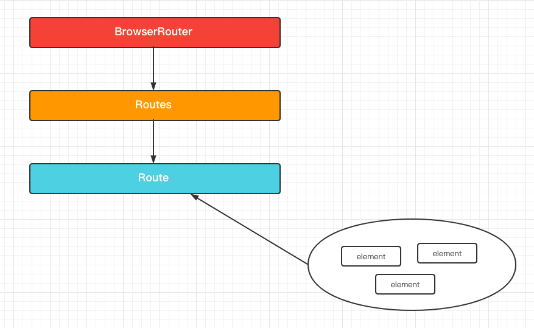
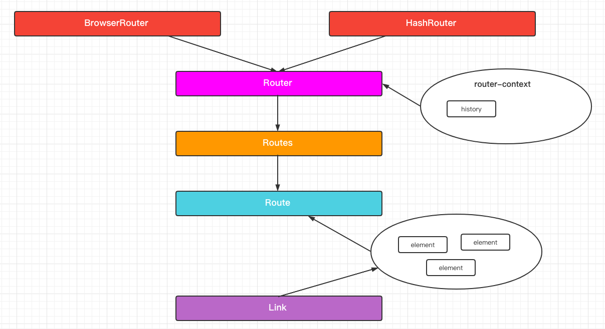
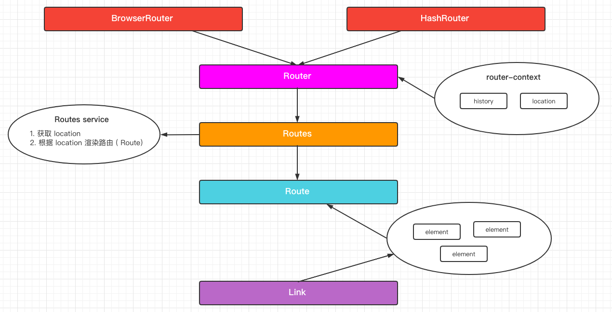
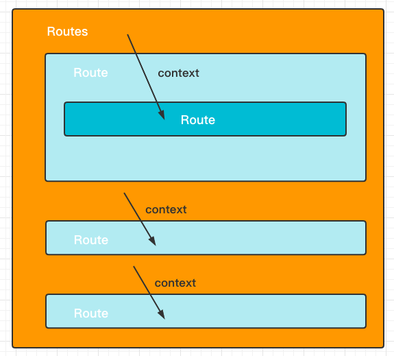
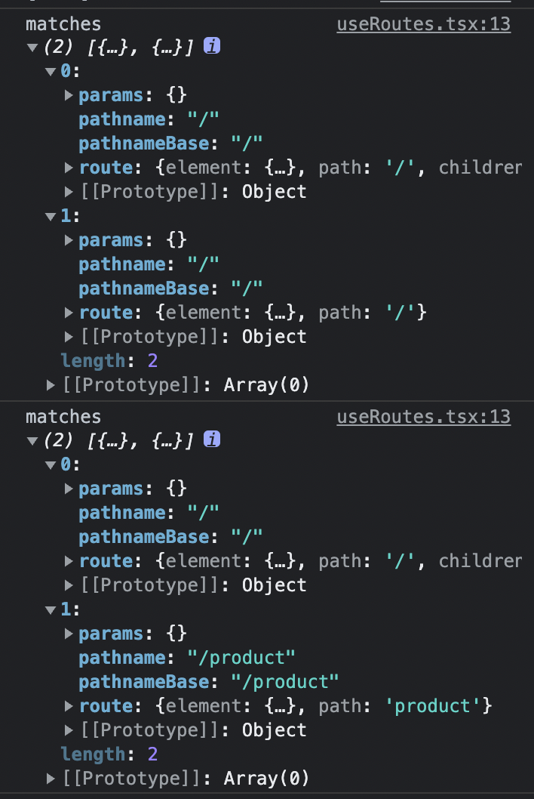
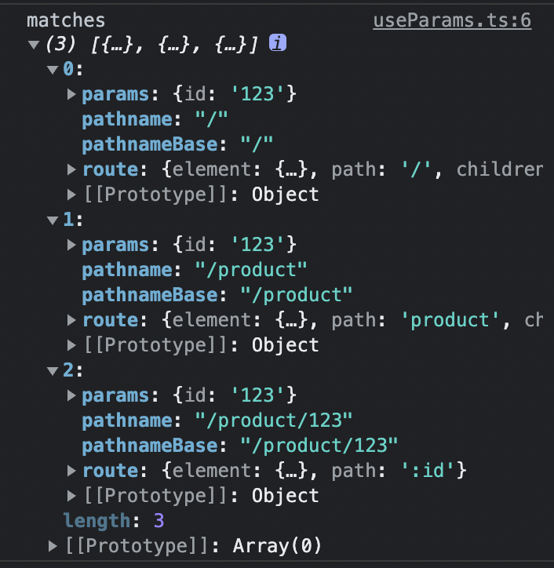
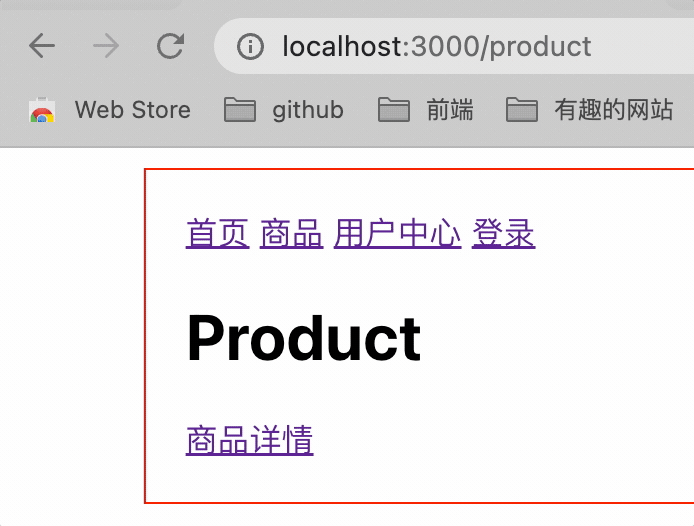

# 手写篇

## 1. 最简实现

首先来看一下最简使用范式

```tsx
import { BrowserRouter as Router, Routes, Route } from '@router'

export default function MyRouterExample() {
  return (
    <Router>
      <Routes>
        <Route path="/" element={<Home />} />
        <Route path="product" element={<Product />} />
      </Routes>
    </Router>
  )
}

function Home() {
  return (
    <div>
      <h1>Home</h1>
    </div>
  )
}

function Product() {
  return (
    <div>
      <h1>Product</h1>
    </div>
  )
}

```

从以上使用范式我们可以得到以下结论：

* 路由组件最外层要有 `<BrowserRouter>` 包裹；
* 被渲染的路由组件要由 `<Routes>` 包裹，用于确认渲染哪个路由组件
* 具体渲染的路由组件 `<Route>` 接收两个参数
  * `path` 表示渲染组件的路由
  * `element` 表示路由到此处时要渲染的组件

根据以上结论，可以确认以下目录结构

* BrowserRouter.tsx
* Routes.tsx
* Route.tsx

**BrowserRouter.tsx**

对于 `BrowserRouter`，在最简实现中先不管它的具体功能，直接把它的子节点渲染出来就好

```tsx
type BrowserRouterProps = {
  children: JSX.Element | JSX.Element[]
}

export function BrowserRouter(props: BrowserRouterProps) {
  const { children } = props
  return <>{children}</>
}
```

这个组件的最简实现很简单，但是值得注意的是对于它的 children 我们定义为 `JSX.Element | JSX.Element[]`，如果我们直接返回 children，会报 TS 错误，JSX.Element[] 不属于 React 组件渲染类型。

为了解决这个问题我们使用 Fragment 对它进行包裹即可。

**Routes.tsx**

这个组件的目的是将它的子组件 `Route` 进行筛选 ( 匹配路由 ) 和渲染。

为了更方便地实现这个目的，我们需要创建一种数据结构来管理，就像 vdom <-> DOM。

这里的实现是 RouteType <-> vdom。

```tsx
// router.d.ts
import type { ReactNode } from 'react'

export type RouteType = {
  path: string
  element: ReactNode
}

// useRoutes.ts
import type { RouteType } from './router.d'

export function useRoutes(routes: RouteType[]) {
  // todo: 暂时这么取当前路由地址
  const pathname = window.location.pathname
  
  return routes
  	.filter(r => pathname === r.path || pathname === `/${r.path}`)
  	.map(route => route.element)
}

// Routes.tsx
import { Children } from 'react'
import type { ReactNode } from 'react'
import type { RouteType } from './router.d'

type RoutesProps = {
  children: JSX.Element | JSX.Element[]
}

export function Routes(props: RoutesProps) {
  const { children } = props
  const routes = createRoutesFromChildren(children)

  const routesElements = useRoutes(routes)
  return <>{routesElements}</>
}

function createRoutesFromChildren(children: JSX.Element | JSX.Element[]) {
  const routes: RouteType[] = []
  
  Children.forEach(children, child => {
    const { element, path } = child.props
    const route: RouteType = { element, path }
    routes.push(route)
  })
  
  return routes
}
```

总结一下，Routes 的作用是对 Route 这个 ReactElement 进行抽象，过程如下所示：

1. `<Routes>` 通过对 `<Route>` 进行抽象管理成 `RouteType`，具体实现是通过 `createRoutesFromFiber()`生成 RouteType
2. 进过上步生成 RouteType 之后使用 `useRoutes()` 进行筛选要渲染的 element
3. 最后渲染筛选后的 routesElement  `return <>{routesElement}</>`

这里的 routesElement 是 JSX.Element[]，因此需要用这种空标签包裹方式达成渲染目的。

React.Children 是 react 提供给用于用来遍历子组件的 api，使用这个 api 会更加方便，不用我们手动判断子组件只有一个还是有多个，而且还帮忙解决了类型问题，当然手动处理也是可以的。

**Route.tsx**

具体的路由组件，对于这个组件我们不关心里面的内容，毕竟 `<Routes>` 最终是取传入这个组件的 `element` 进行渲染，这个组件的返回值稍微意思意思就行了。

```tsx
import type { RouteType } from './router.d'

export function Route(props: RouteType) {
  return <div />
}
```

至此，我们已经初步实现 react-router 了。


## 2. 实现路由切换

在实现这个功能之前，先完善一下 demo。

```tsx
import { BrowserRouter as Router, Routes, Route, Link } from '@router'
import styles from './router.module.less'

export default function MyRouterExample() {
  return (
    <Router>
      <Routes>
        <Route path="/" element={<Layout />}>
          <Route path="/" element={<Home />} />
          <Route path="product" element={<Product />} />
        </Route>
      </Routes>
    </Router>
  )
}

function Layout() {
  return (
    <div className={styles.layout}>
      <Link to="/">首页</Link>
      <Link to="/product">商品</Link>

      {/* <Outlet /> */}
    </div>
  )
}

function Home() {
  return (
    <div>
      <h1>Home</h1>
    </div>
  )
}

function Product() {
  return (
    <div>
      <h1>Product</h1>
    </div>
  )
}

```

为了渲染子路由，需要用到 `<Outlet>`，但实现路由切换暂时不需要这个功能，这里只专心于路由切换。

目前为止，最简 router 的实现结构如下所示：



实现路由跳转最终肯定是由 a 标签实现，在 router 中的表现即为 `<Link />`。

在 `<Link />` 中为了实现路由跳转，我们需要借助 history 库。又由于在一个项目中，我们需要一个统一的路由管理，就像 redux 一样，在全局只需要实例化一个仓库，因此我们也需要在根组件实现 history 实例，然后通过 context 传给它的子组件。

因此我们有了如下新的结构：




这里新增了一个 `<Router>`，是为了方便管理 `router-context`，因为 `BrowserRouter` 和 `HashRouter` 使用的 history 实例方法是不一样的。

在目前的实现中，我们先只关心 BrowserRouter。

* routerContext.ts
* BrowserRouter.tsx
* Router.tsx
* Routes.tsx
  * useRoutes.ts
* Route.tsx
* Link.tsx
  * useNavigate.ts

**router.d.ts**

```ts
import type { ReactNode } from 'react'

export type RouteType = {
  path: string
  element: ReactNode
  children?: RouteType[]
}
```

**routerContext.ts**

```ts
import type { BrowserHistory } from 'history'
import { createContext } from 'react'

type RouterService = {
  navigator: BrowserHistory
}

export const RouterContext = createContext<RouterService>({} as RouterService)
```

这里定义了 router-context 的内容，整体就是创建了一个 context。

需要注意的是这里给了一个默认值只是为了不让 ts 报错，具体的赋值得在 `<Router>` 中实现。

**BrowserRouter.tsx**

```tsx
import type { ReactNode } from 'react'
import { useRef } from 'react'
import { createBrowserHistory } from 'history'
import { Router } from './Router'

type BrowserRouterProps = {
  children: ReactNode
}

export function BrowserRouter(props: BrowserRouterProps) {
  const { children } = props
  
  const navigator = useRef(createBrowserHistory()).current
  
  return <Router navigator={navigator}>{children}</Router>
}
```

如果是 `<HashRouter>`，就得用哈希路由的方法。

`ReactNode` 是 React 定义的一个类型，它表示 React 的所有子节点类型，包括一般的组件、字符串、数字、undefined、null 等等。一般 children 直接用这个类型非常方便，但是如果是用组件的表现形式，比如 `<children />`，就得写成 `JSX.Element`，因为字符串、数字等类型都不能作为 React 组件解析。

**Router.tsx**

```tsx
import type { BrowserHistory } from 'history'
import type { ReactNode } from 'react'
import { useRef } from 'react'
import { RouterContext } from './routerContext'

type RouterProps = {
  navigator: BrowserHistory
  children: ReactNode
}

export function Router(props: RouterProps) {
  const { navigator, children } = props
  const routerService = useRef({ navigator }).current
  
  return (
  	<RouterContext.Provider value={routerService}>
    	{children}
    </RouterContext.Provider>
  )
}
```

**Routes.tsx**

在编写组件之前先回顾最新的 demo，可以发现 `<Routes>` 是可以嵌套使用的，因此我们在这里需要处理嵌套路由的情况。

```tsx
export default function MyRouterExample() {
  return (
    <Router>
      <Routes>
        <Route path="/" element={<Layout />}>
          <Route path="/" element={<Home />} />
          <Route path="product" element={<Product />} />
        </Route>
      </Routes>
    </Router>
  )
}
```

```tsx
import { Children } from 'react'
import { useRoutes } from './useRoutes'
import type { RouteType } from './router.d'

type RoutesProps = {
  children: JSX.Element | JSX.Element[]
}

export function Routes(props: RoutesProps) {
  const { children } = props
  const routes = createRoutesFromChildren(children)
  
  const routesElement = useRoutes(routes)
  return <>{routesElement}</>
}

function createRoutesFromChildren(children: JSX.Element | JSX.Element[]) {
  const routes: RouteType[] = []
  
  Children.forEach(children, child => {
    const { children, element, path } = child.props as RouteType & {
      children?: JSX.Element | JSX.Element[]
    }
  	const route: RouteType = { element, path }
    
    // ++++++++++++++++++++++++++++++++++++++++++++++++++
    if (children) {
      route.children = createRoutesFromChildren(children)
    }
    // ++++++++++++++++++++++++++++++++++++++++++++++++++
    
    routes.push(route)
  })
  
  return routes
}
```

**useRoutes.ts**

```ts
import type { RouteType } from './router.d'

export function useRoutes(routes: RouteType[]) {
  const pathname = window.location.pathname
  
  return routes
  	// 渲染子路由的时候必渲染父路由，如果只用全等来判断只能匹配路由名完全相等的
  	.filter(r => pathname.startsWith(r.path))
  	.map(route => route.element)
}
```

**Route.tsx**

```tsx
import type { RouteType } from './router.d'

export function Route(props: RouteType) {
  return <div />
}
```

这个组件依然没发生变化，因为我们不关心其返回值。

**Link.tsx**

```tsx
import type { MouseEvent } from 'react'
import { useCallback } from 'react'
import { useNavigate } from './useNavigate'

type LinkProps = {
  to: string
  children: string
}

export function Link(props: LinkProps) {
  const { children, to } = props
	const navigate = useNavigate()
  
  const handleClick = useCallback(
    (e: MouseEvent<HTMLAnchorElement>) => {
      e.preventDefault()
      navigate(to)
  	},
    [to]
  )

  return (
  	<a href={to} onClick={handleClick}>
    	{children}
    </a>
  )
}
```

路由跳转组件本质还是 a 标签，但是我们得做些改变。

首先要防止默认行为，点击 a 标签默认会刷新，这样会造成不必要的资源请求。

其次是利用 history 实例实现路由的跳转。

**useNavigate.ts**

```ts
import { useContext } from 'react'
import { RouterContext } from './routerContext'

export function useNavigate() {
  const { navigator } = useContext(RouterContext)
  return navigator.push
}
```


至此我们已经能实现基本的路由跳转了，但是路由组件还没渲染出来，这个后面接着实现。


## 3. 实时监听路由

在目前的实现中，我们使用的 window.location.pathname 进行路由的获取。这种方法有一个缺陷就是不能实时根据跳转的路由渲染，也就是只能渲染一遍，因此我们需要有一个状态来实现实时监听。

在 history 中有一个 location 对象可以帮助完成这个工作。



从图中可以知道，可以在 Router 那将 location 传下去，然后 `<Routes>` 根据传下来的 location 进行路由渲染。

* routerContext.ts
* BrowserRouter.tsx
* Router.tsx
* Routes.tsx
  * useRoutes.ts
    * useLocation.ts


**routerContext.ts**

```ts
import type { BrowserHistory, Location } from 'history'
import { createContext } from 'react'

type RouterService = {
  navigator: BrowserHistory
  location: Location
}

export const RouterContext = createContext<RouterService>({} as RouterService)
```

此时的 `RouterContext` 相比之前的实现多了个 `location`。

**BrowserRouter.tsx**

```tsx
import type { ReactNode } from 'react'
import { useLayoutEffect, useState } from 'react'
import { createBrowserRouter } from 'history'
import { Router } from './Router'

type BrowserRouterProps = {
  children: ReactNode
}

export function BrowserRouter(props: BrowserRouterProps) {
  const { children } = props
  const navigator = useRef(createBrowserRouter()).current
  
  const [locationObj, setLocationObj] = useState({ location: navigator.location })
  
  useLayoutEffect(() => {
    navigator.listen(setLocationObj)
  }, [])
  
  return (
  	<Router navigator={navigator} location={locationObj.location}>
    	{children}
    </Router>
  )
}
```

当前组件实现比之前多了一个 `locationObj` 这个状态，之所以要设置成对象是因为在订阅时，当路由发生变化后会重新赋值，值类型为带 `location` 字段的对象，因此这里使用对象类型作为状态会更加方便。

另外一个老生常谈的问题是初始化订阅要使用 `useLayoutEffect`。

`useEffect` 是在 dom 提交前异步执行，而 `useLayoutEffect` 是在 dom 提交后同步执行，为了能准确拿到初始值，关于订阅的方法最好都在 `useLayoutEffect` 中使用。

**Router.tsx**

```tsx
import type { BrowserHistory, Location } from 'history'
import type { ReactNode } from 'react'
import { useMemo } form 'react'
import { RouterContext } from './routerContext'

type RouterProps = {
  navigator: BrowserHistory
  location: Location
  children: ReactNode
}

export function Router(props: RouterProps) {
  const { navigator, location, children } = props
  
  const routerService = useMemo(() => {
    return { navigator, location }
  }, [location])
  
  return (
  	<RouterContext.Provider value={routerService}>
    	{children}
    </RouterContext.Provider>
  )
}
```

在之前的实现中我们使用的是 `useRef` 来实现 `routerService`，那是因为 `BrowserHistory` 只要实例化一次就行了，但是现在 `location` 会随着路由的变化而变化，因此需要使用 `useMemo` 来动态变化。

**useRoutes.ts**

```ts
import type { RouteType } from './router.d'
import { useLocation } from './useLocation'

export function useRoutes(routes: RouteType[]) {
  const location = useLocation()
  const pathname = location.pathname
  
  return routes
  	// 渲染子路由的时候必渲染父路由，如果只用全等来判断只能匹配路由名完全相等的
  	.filter(r => pathname.startsWith(r.path))
  	.map(route => route.element)
}
```

**useLocation.ts**

```ts
import { useContext } from 'react'
import { RouterContext } from '../LayoutRouter/routerContext'

export function useLocation() {
  const { location } = useContext(RouterContext)
  return location
}
```

至此，我们已经可以实时获取最新路由了。


## 4.  实现路由渲染

目前我们已经可以实现第一级的路由渲染，但是其子路由还没出现。

在 `react-router6` 中，子路由页面的渲染需要通过 `<Outlet>` 展示出来。

先看一下更新后的 demo。

```tsx
import { BrowserRouter as Router, Routes, Route, Link, Outlet } from '@router'
import styles from './router.module.less'

export default function MyRouterExample() {
  return (
    <Router>
      <Routes>
        <Route path="/" element={<Layout />}>
          <Route path="/" element={<Home />} />
          <Route path="product" element={<Product />} />
        </Route>
      </Routes>
    </Router>
  )
}

function Layout() {
  return (
    <div className={styles.layout}>
      <Link to="/">首页</Link>
      <Link to="/product">商品</Link>

      <Outlet />
    </div>
  )
}

function Home() {
  return (
    <div>
      <h1>Home</h1>
    </div>
  )
}

function Product() {
  return (
    <div>
      <h1>Product</h1>
    </div>
  )
}
```

`<Route>` 和它的渲染组件对应关系如下

```
Route ( Layout )
	- Route ( Home )
	- Route ( Product )
	
Layout
	- Home
	- Product
```

很明显，`<Outlet>` 要放在 `<Layout>` 组件中，才能将 `<Home>` 和 `<Product>` 渲染出来。

* routerContext.ts
* BrowserRouter.tsx
  * routerContext.ts
* Router.tsx
* Routes.tsx
  * <span style="color:red">routesContext.ts</span>
  * <span style="color:red">useRoutes.ts</span>
    * useLocation.tsRoute.tsx
* <span style="color:red">Outlet.tsx</span>
  * <span style="color:red">useOutlet.ts</span>
* Link.tsx
  * useNavigate.tsx
* <span style="color:red">utils.ts</span>

**routesContext.ts**

```ts
import { createContext } from 'react'

type RoutesService = {
  outlet: JSX.Element
}

export type RoutesContext = createContext<RoutesService>({} as RoutesService)
```


**useRoutes.ts**

```tsx
import type { RouteType } from '../router'
import { RoutesContext } from './routesContext'
import { normalizePathname } from '../utils'
import { useLocation } from './useLocation'
import { Outlet } from '@router/Outlet/Outlet'

export function useRoutes(routes: RouteType[]) {
  const location = useLocation()
  const pathname = location.pathname
  
  return (
  	routes
    	.filter(r => pathname.startsWith(r.path))
    	.map(route => {
        if (route.children) {
          const c = Array.isArray(route.children) ? route.children : [route.children]
          
          return c.map(child => {
            const match = normalizePathname(child.path) === pathname
            if (match) {
              return (
              	<RoutesContext.Provider value={{ outlet: child.element as JSX.Element }}>
                	{route.element !== undefined ? route.element : <Outlet />}
                </RoutesContext.Provider>
              )
            }
          })
        }

        return route.element
      })
  )
}
```

此处的 `<Routes>` 可以类比为 v5 的 `<Switch>`。



对于 `<Routes>` 的每一个子 `<Route>` 都用 `<RoutesContext.Provider>` 包裹，并将 `outlet` 传下去。

outlet 为子 `<Route>` 的 Element。

```tsx
<RoutesContext.Provider value={{ outlet: child.element as JSX.Element }}>
  {route.element !== undefined ? route.element : <Outlet />}
</RoutesContext.Provider>
```


回顾一下demo，当前的目录结构为：

```tsx
<Routes>
  <Route path="/" element={<Layout />}>
    <Route path="/" element={<Home />} />
    <Route path="product" element={<Product />} />
  </Route>
</Routes>


function Layout() {
  return (
    <div className={styles.layout}>
      <Link to="/">首页</Link>
      <Link to="/product">商品</Link>

      <Outlet />
    </div>
  )
}
```

当路由为 `/product`，`<Routes>` 渲染的是 `<Layout>`，此时 `RoutesContext` 传递的 `outlet` 是 `<Product />`。

所以在父 `<Route />` 里面渲染的 `<Outlet />` 就是 `<Product />`。


**utils.ts**

```ts
//*   ///product/detail/// -> /product/detail
export const normalizePathname = (pathname: string) => {
  return pathname.replace(/\/+$/, '').replace(/^\/*/, '/')
}
```

**Outlet.tsx**

```tsx
import { useOutlet } from './useOutlet'

export function Outlet() {
  const outlet = useOutlet()!
	return outlet
}
```

**useOutlet.ts**

```ts
import { RoutesContext } from '../Routes/routesContext'
import { useContext } from 'react'

export function useOutlet() {
  const { outlet } = useContext(RoutesContext)
  return outlet
}
```

`<Outlet>` 的原理很简单，就是接收并渲染跟自己最近的 `<Route>` 的 Provider 提供的 `outlet`。


## 5. 实现动态路由渲染

在实现动态路由渲染之前，我们先把前面的在渲染 `<Routes>` 时对于 key 的警告。

既然返回一个数组需要对 key 进行处理，那不返回数组不就行了。而既要不返回数组，又得把需要渲染的嵌套路由渲染出来，唯一的办法就是把各个路由组件按照层级关系组合成一个组件。

为此我们需要一个 react-router-dom 提供的方法 `matchRoutes`，它能将匹配的路由从左往右按层级变成一个数组，这时候我们只需要使用 `reduceRight` 对路由组件进行组合即可。

matchRoutes 的返回结果如下，它会返回当前路由匹配的所有路由组件。



**useRoutes.tsx**

```tsx
import { RoutesContext } from './routesContext'
import type { RouteType } from '../router'
import { useLocation } from './useLocation'
import { matchRoutes } from 'react-router-dom'

type MatchType = ReturnType<typeof matchRoutes>
                            
export function useRoutes(routes: RouteType[]) {
  const location = useLocation()
  const pathname = location.pathname
  
  const matches = matchRoutes(routes as any, { pathname })
  return renderMatches(matches)
}

function renderMatches(matches: MatchType) {
  if (!matches) return null
  
  return matches.reduceRight((outlet, match) => {
    return (
    	<RoutesContext.Provider value={{ outlet, matches }}>
      	{match.route.element || outlet}
      </RoutesContext.Provider>
    )
  }, null as any)
}
```

这里的渲染逻辑很简单，对于每一个 `<Routes>`，如果有 element 就用自己的 element，如果没有就用子孙组件的。

**注意，**这里说的是子孙组件，因为理论上可以存在连续几个 `<Routes>` 都没有自己 element 的情况，这个时候就用子孙 `<Route>` 的第一个 element。

至此，key 警告就已经消除了。


为了体现动态路由，先更新一下 demo

```tsx
import {
  BrowserRouter as Router,
  Routes,
  Route,
  Link,
  Outlet,
  useNavigate,
  useParams,
} from '@router'
import styles from './router.module.less'

export default function MyRouterExample() {
  return (
    <Router>
      <Routes>
        <Route path="/" element={<Layout />}>
          <Route path="/" element={<Home />} />
          <Route path="product" element={<Product />}>
            <Route path=":id" element={<ProductDetail />} />
          </Route>
        </Route>
      </Routes>
    </Router>
  )
}

function Layout() {
  return (
    <div className={styles.layout}>
      <Link to="/">首页</Link>
      <Link to="/product">商品</Link>

      <Outlet />
    </div>
  )
}

function Home() {
  return (
    <div>
      <h1>Home</h1>
    </div>
  )
}

function Product() {
  return (
    <div>
      <h1>Product</h1>
      <Link to="/product/123">商品详情</Link>

      <Outlet />
    </div>
  )
}

function ProductDetail() {
  const navigate = useNavigate()
  const params = useParams()

  return (
    <div>
      <h1>ProductDetail</h1>
      <p>{params?.id}</p>
      <button onClick={() => navigate('/')}>go home</button>
    </div>
  )
}

```

相比上一版本的 demo，该版本添加了 `<ProductDetail>` 组件。

在渲染路由中，`<ProductDetail>` 在 `<Product>` 之下，也就是说在路由 `/product` 之后才会渲染 `<ProductDetail>`。

由于在上文我们使用了 `matchRoutes()` 负责路由渲染，因此当匹配到 `<ProductDetail>` 之后，会自动帮助处理动态路径。

把 `<ProductDetail>` 中关于 params 的代码注释掉之后可以发现页面是正常显示的。

接下来就关注怎么实现 `useParams` 即可。

当在路由中输入 `/product/123` 之后，我们可以通过 `RoutesContext` 得到以下 matches



很明显，`<ProductDetail>` 匹配的路由元素是最后一个。在获取 `params` 时，为了保证准确性，我们最好从 matches 的最后一个元素那取，因为 params 在传递的过程中可能发生改变。

**useParams.ts**

```ts
import { useContext } from 'react'
import { RoutesContext } from '@router/Routes/routesContext'

export function useParams() {
  const { matches } = useContext(RoutesContext)
  return matches?.[matches?.length - 1].params
}
```

至此，动态路由渲染的实现就完成了。 


## 6. 实现 `<Navigate>`

react-router 的路由导航有三种方式

* `<Link>`
  本质为 a 标签

* `<Navitage>`

  组件形式的导航

* `const history = useHistory()`
  JS 方法导航

`<Navigate>` 虽然看上去是组件形式的导航，但是底层还是用了 `history`，可以说第二种和第三种方法是互补关系。

在实现 `<Navigate>` 的时候，我们需要对之前实现的 `useNavigate` 也作修改。

* Navigate.tsx
* useNavigate.ts

**Navigate.tsx**

```tsx
import type { Location } from 'react-router-dom'
import { useEffect } from 'react'
import { useNavigate } from './useNavigate'

type NavigateProps = {
  to: string | number
  state?: { from: Location }
  replace?: boolean
}

export function Navigate(props: NavigateProps) {
  const { to, state, replace } = props
  const navigate = useNavigate()
  
  useEffect(() => {
    navigate(to, { state, replace })
  }, [])
  
  return null
}
```

注意在 `<Navigate>` 中，该组件并不实际渲染任何元素。

路由导航属于副作用，因此需要写在副作用回调中。

**useNavigate.ts**

```ts
import type { Location } from 'react-router-dom'
import { useCallback, useContext } from 'react'
import { RouterContext } from '../LayoutRouter/routerContext'

type NavigateOptions = {
  state?: { from: Location }
  replace?: boolean
}

export function useNavigate() {
  const { navigator } = useContext(RouterContext)
  
  const navigate = useCallback((to: string | number, options?: NavigateOptions) => {
    if (typeof to === 'number') return navigate.go(to)
    
    if (options?.replace) {
      navigator.replace(to)
    } else {
      navigator.push(to, options?.state)
    }
  }, [])
  
  return navigate
}
```

假设有以下场景，用户点击的路由如下所示

```
商品详情 -- 自动导航 --> 登录页 -- 登录 --> 跳转到用户中心
```

当用户登录后，再点返回，这是我们并不希望用户再返回登录页，而是返回之前的“商品详情”页，在这种情况下就需要用 replace 来将登录后跳转到的“用户中心”页替换“登录页”。

```
商品详情 ----> 用户中心
```

这时，用户如果点击返回上一路由，就能回到商品详情页了。



# 应用篇

## 路由守卫

一般项目中，通常会区分 登录/游客 状态，或者有些会员能浏览到非会员不能浏览到的页面，这个时候就需要路由守卫。

这里演示 `react-router6` 的一种实现方式。

* auth.tsx  用于提供路由守卫服务
* RouteGuard.tsx  路由守卫应用

我们的实现思路是，将验证态放在一个路由 context 中，然后封装该 context 的提供者和消费者，对需要路由守卫的 Route 进行包裹。

**auth.tsx**

```tsx
import { ReactNode, useContext } from 'react'
import { createContext, useCallback, useMemo, useState } from 'react'

// 一个假登录/登出方法
export const fakeAuthProvider = {
  isAuthenticated: false,
  signIn(callback: (...args: any[]) => any) {
    fakeAuthProvider.isAuthenticated = true
    setTimeout(callback, 100) // fake async
  },
  signOut(callback: (...args: any[]) => any) {
    fakeAuthProvider.isAuthenticated = false
    setTimeout(callback, 100)
  },
}

//! 路由守卫具体实现
type AuthContextType = {
  user: string | FormDataEntryValue | null
  signIn: (
  	username: string | FormDataEntryValue | null,
  	callback?: () => void
  ) => void
  signOut: (callback?: () => void) => void
}

const AuthContext = createContext<AuthContextType>({} as AuthContextType)

type AuthProviderProps = {
  children: ReactNode
}

export function AuthProvider(props: AuthProviderProps) {
  const [user, setUser] = useState<string | FormDataEntryValue | null>(null)
  
  const signIn = useCallback(
    (username: string | FormDataEntryValue | null, callback?: () => void)
    	setUser(username)
  		callback?.()
  	},
    [],
  )
  
  const signOut = useCallback((callback?: () => void) => {
    setUser(null)
    callback?.()
  }, [])
  
  const value = useMemo(() => {
    return { user, signIn, signOut }
  }, [user])
  
  return <AuthContext.Provider value={value}>{children}</AuthContext.Provider>
}

export function useAuth() {
  return useContext(AuthContext)
}
```

**RouteGuard.tsx**

```tsx
import type { FormEvent } from 'react'
import { useCallback } from 'react'
import {
  BrowserRouter as Router,
  Routes,
  Route,
  Link,
  Outlet,
  useNavigate,
  useParams,
  Navigate,
  useLocation,
} from 'react-router-dom'

import { AuthProvider, useAuth } from './auth'

import styles from './router.module.less'

export default function RouteGuardExample() {
  return (
    <AuthProvider>
      <Router>
        <Routes>
          <Route path="/" element={<Layout />}>
            <Route path="/" element={<Home />} />
            <Route path="product" element={<Product />}>
              <Route path=":id" element={<ProductDetail />} />
            </Route>
            <Route
              path="user"
              element={
                <RequireAuth>
                  <User />
                </RequireAuth>
              }
            />
            <Route path="login" element={<Login />} />
            <Route path="*" element={<NoMatched />} />
          </Route>
        </Routes>
      </Router>
    </AuthProvider>
  )
}

function Layout() {
  return (
    <div className={styles.layout}>
      <Link to="/">首页</Link>
      <Link to="/product">商品</Link>
      <Link to="/user">用户中心</Link>
      <Link to="/login">登录</Link>

      <Outlet />
    </div>
  )
}

function Home() {
  return (
    <div>
      <h1>Home</h1>
    </div>
  )
}

function Product() {
  return (
    <div>
      <h1>Product</h1>
      <Link to="/product/123">商品详情</Link>

      <Outlet />
    </div>
  )
}

function ProductDetail() {
  const navigate = useNavigate()
  const params = useParams()

  return (
    <div>
      <h1>ProductDetail</h1>
      <p>{params?.id}</p>
      <button onClick={() => navigate('/')}>go home</button>
    </div>
  )
}

function User() {
  const auth = useAuth()
  const navigate = useNavigate()

  const handleSignOut = useCallback(() => {
    auth.signOut(() => navigate('/login'))
  }, [])

  return (
    <div>
      <h1>User</h1>
      <p>{auth.user!.toString()}</p>
      <button onClick={handleSignOut}>退出登录</button>
    </div>
  )
}

function Login() {
  const auth = useAuth()
  const navigate = useNavigate()
  const location = useLocation()
  const from = (location.state as any)?.from.pathname ?? '/'

  const submit = useCallback((e: FormEvent<HTMLFormElement>) => {
    const formData = new FormData(e.currentTarget)
    const username = formData.get('username')

    auth.signIn(username, () => {
      navigate(from, { replace: true })
    })
  }, [])

  if (auth.user) {
    return <Navigate to={from} />
  }

  return (
    <div>
      <h1>Login</h1>
      <form onSubmit={submit}>
        <input type="text" name="username" />
        <button type="submit">login</button>
      </form>
    </div>
  )
}

function NoMatched() {
  return (
    <div>
      <h1>NoMatched</h1>
    </div>
  )
}

type RequireAuthProps = {
  children: JSX.Element
}

function RequireAuth(props: RequireAuthProps) {
  const { children } = props
  const location = useLocation()
  const auth = useAuth()

  if (!auth.user) {
    return <Navigate state={{ from: location }} to="/login" replace />
  }

  return children
}

```

要应用路由守卫，首先要对 `<Router>` 用 `<AuthProvider>` 进行包裹，这样路由组件才能通过 `useAuth()` 获取当前用户状态。

然后要封装路由守卫的实现组件 `<RequireAuth>`，用它来包裹需要验证用户状态的组件，其实现非常简单，思路就是先通过 `useAuth()` 获取当前用户状态，然后进行判断，如果已登录就返回其本应渲染的组件，如果未登录就返回登录页。

当然我们可以用多个 context 来实现不同角度的验证，比如验证是否登录、是否为会员、如果是会员等级有多高等等。

最后需要注意的是，在登录组件有个 from 变量

```ts
const from = (location.state as any)?.from.pathname ?? '/'
```

它的作用是，假如用户直接通过路由访问某个需要登录才能访问的页面，这时候被送到了登录页，然后用户在登录之后应该直接跳到登录前访问的页面，而不是回到首页。这种场景常见于在某些页面待的时间太长导致登录 token 过期，再访问时就自动跳转到登录页，当然也可以做个轮询，当检查到 token 过期直接导航到登录页。

还有一种场景是没有相应的会员权限，然后用户充值之后应该直接跳到购买权限前访问的页面。

如果用户是直接访问的登录页，那登录之后就直接跳到首页好了。

要注意这里的 ts 写法，目前为止，官方提供的类型 Location，对于 `Location.state` 的定义是 unknown，但是打印 location 时可以发现这个访问路径确实是正确的，因此这里用一个兼容写法 `(location.state as any)`。当然这个问题可能会在后续版本中得到修复。


